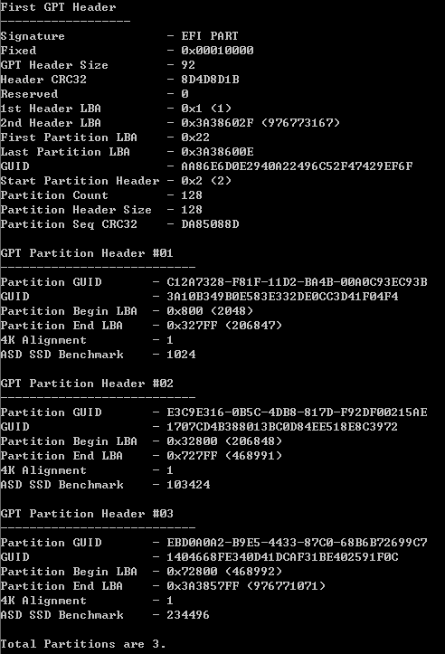

# WinGPT
The tool dumps "GPT Header" and "GPT Partition Header" on Windows.

It is written by pure C (C99) and Win32 API.

It can also check SSD 4K alignment.

## How to build
1. Download TDM-GCC-64.
2. Modify Build.bat for your installation path.
3. Run Build.bat.

## FAQ
1. If you run it on Windows 10, you must use CMD windows that has administrator privilege.
2. You can use argv to dump another disk information -> "WinGPT.exe 1".

## Running

